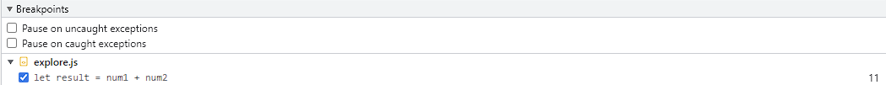
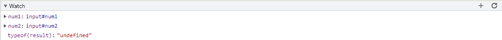
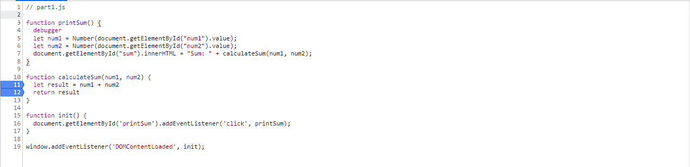

## DevTools - Debugging

### Question 1:

The problem of this program is that the variable **num1** and **num2** save the inputs as type string. Therefore, when we try to add those 2 variables, it become a string by concatenating two strings together.

### Question 2:

There are probably many ways to fix this bug, but the way I used is to convert the user's input data from type string to type number and saves it in the 2 **num** variables.

